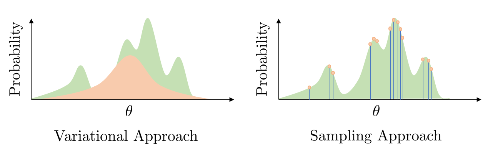
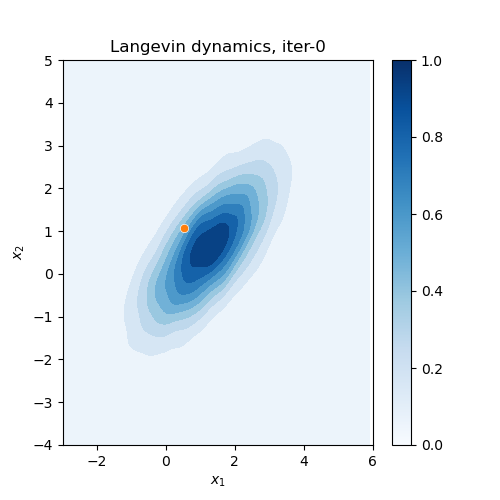
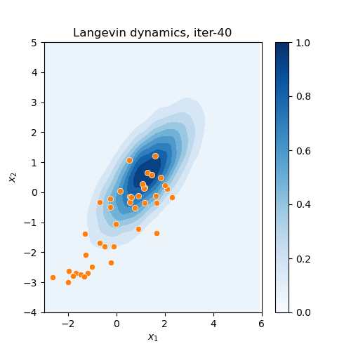
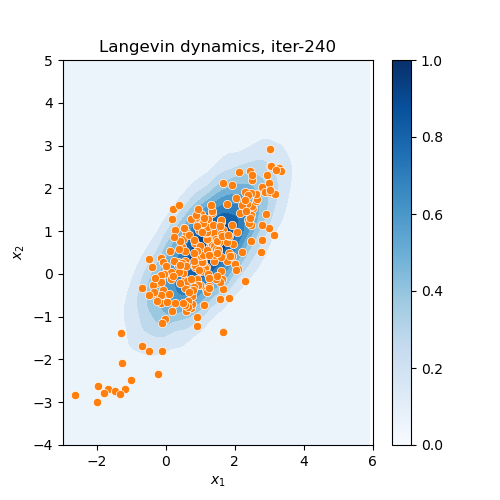

# Langevin Dynamics Sampling of Prompt Distribution for Vision-Language Model

## Background
This repository uses Langevin Dynamics in optimisation where each step of the optimisation update resembles the sampled prompt parameters from the underlying prompt distribution. By saving the sampled prompt along the Langevin Dynamics Sampling trajectory, we then later used them to conduct hard ensemble voting in test time prediction. The intuitive idea of Langevin Dynamics Sampling versus the variational approach is shown in the figure below:

<p align="center">
  
  <br> Fig.1: The distribution in green is the target distribution to estimate. For the variational approach, the orange distribution on the left fits a Gaussian function on the target green distribution. In contrast, in the sampling-based method in the figure on the right, the orange dots are drawn directly from the target green distribution. As we can see, the sample drawn often comes from the high probability region of the target distribution.
</p>


To better show how the sampling is conducted using the Langevin Dynamics, consider a stationary distribution in Fig. 2, which is unknown in its analytical expression to the Langevin Dynamics particle, where the darker colour represents a higher density region. The orange dot represents the footprint of the Langevin Dynamics particle's movement. As the iteration progresses from 1 to 240, we can see the orange footprints visit the high-density region more, hence recovering the underlying unknown blue distribution.


<p align="center">
  
   
  
  <br>
    Fig 2: Langevin Dynamics particle movement.
</p>


## Setup

1. Create two folders ''datasets'',''clip_pretrained'' under the project directory. Download the official cifar dataset from [Here](https://www.cs.toronto.edu/~kriz/cifar.html) and put it in the ``datasets'' folder. Download the CLIP model pretrained weights from [(Here)](https://drive.google.com/drive/folders/1Jw1u5xkyeY7hkmsyV6nqAKsXL1OMGCg6?usp=sharing) and put it in ''clip_pretrained'' folder. 
    ```
    COOP_Langevin_Public
    ├── datasets
    │   ├── cifar-10-python
    │   ├── cifar-100-python
    ├── clip_pretrained
    |   ├── RN50.pt
    |   ├── Vit-B-32.pt
    │...
    ```
2. Clone this repo
    ```
    git pull https://github.com/Walter-pixel/COOP_Langevin_Public.git main
    ```
    
3. Install dependencies in your conda environment, the Pytorch version ```torch==2.0.1``` is used
    ```
    pip install -r requirements.txt
    ```

## Experiment of CIFAR10-LT
### Code Runs
1. First pre-train the prompt generator with no noise for imbalanced ratio=.005/.01/.02/.1 of CIFAR10-LT. The smaller imbalanced ratio here stands for a more imbalnaced scanerio.
    ```
    cd ./script
    bash no_noise_train.sh
    ```
2. Use the checkpoint saved in the previous step as initialization, now starts Langevin Dynamics training phase
    ```
    cd ./script
    bash LD_train.sh
    ```
3. Check the results
    ```
    tensorboard --logdir ./log_cifar10 --port 8765
    ```


 ### Empirical Results

Below is the result of balanced test set accuracy using models that were previously trained on different imbalanced ratio training datasets. "LD 1-model" means only taking one model saved at the last LD training phase, while "LD 80-model" means using the saved models from the last 80 epochs of the LD training phase to carry out the hard ensemble voting. 

  | Degree of Imbalance  | Learn  | Variational | LD 1-model | LD 80-model |
  |----------------------|--------|------------:|-----------:|------------:|
  | Imbalanced Ratio=.005 | Prompt |       77.06 |      75.25 |       76.34 |
  | Imbalanced Ratio=.01 | Prompt |       78.50 |      76.15 |       77.86 |
  | Imbalanced Ratio=.02  | Prompt |       79.03 |      78.33 |       78.60 |
  | Imbalanced Ratio=.1  | Prompt |       79.46 |      78.70 |       79.56 |

## Acknowledgements
Our development is basaed on the CoOp model [(Here)](https://github.com/KaiyangZhou/CoOp), where CoOp is an automatic prompt tunning strategy built for the vision-language foundation model CLIP [(Here)](https://github.com/openai/CLIP).


